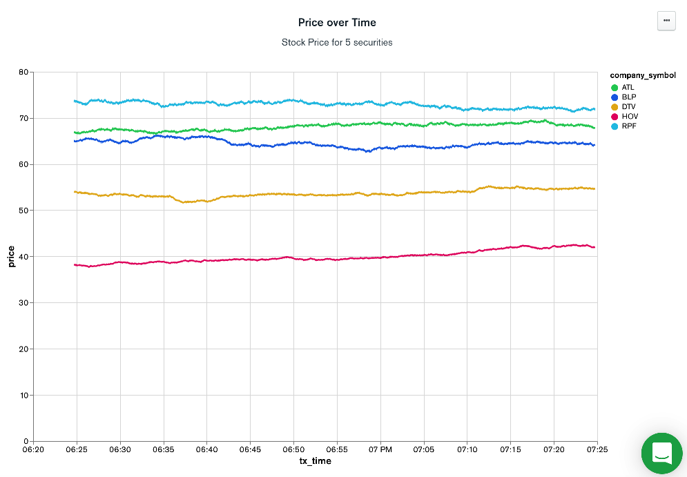

# StockPriceGenerator

This tool will populate a MongoDB database with fake stock price data. Users can specify how many random stock ticker symbols to create as well as how long the data generation should span. Users can also write the data as a time series collection if using MongoDB version 5.0 and above.
  
Usage:

`stockgen.py [-h] [-s NUMBER_OF_SYMBOLS] [-c CONNECTION_STRING] [-d DATABASE_NAME] [-col COLLECTION_NAME] [-x DURATION] [-drop]  [-ts]  [-as]`


  |   Parameter             |Description |Default                        |
|----------------|-----------------------------|---------|
| -s |the number of company symbols|5|
|-c |MongoDB Connection string|127.0.0.1|
|-d|Destination database name|StockData|
|-col|Destination collection name|Stocks|
|-x|Number of minutes of data to generate|0 - forever
|-drop|Drop destination collection|
|-ts|Create as timeseries collection|
|-as|Write the tx time as string|
|-h|Lists help on parameters|

>**Note:** Time series collections as of MongoDB 5.0 requires the timefield to be in datetime format.  In this data generator, the *tx_time* field is used as the timefield.  Thus, if you specify -as and -ts, the data generator will ignore the request to write the *tx_time* as a string.  This will be changed once MongoDB supports timefields of different data types.

Example:

`python3 stockgen.py -c 'MONGODB CONNECTION STRING GOES HERE'-s 5 -x 60 -drop -d MyStockExchange -col Securities -ts`

In this example, the data generator will create the Securities collection in the MyStockExchange database as a time-series collection.  It will first drop the collection before writing 60 minutes worth of 5 security symbols.

```
Checking MongoDB Connection
Successfully connected to MongoDB

Dropping collection Securities

Create collection result=MyStockExchange.Securities
Data Generation Summary:
# symbols    5           
Database     MyStockExchange
Collection   Securities  

Symbol    Company Name                                      
BLP       BEWILDERED LADY PARTNERS                          
ATL       AGGRESSIVE TABLE LABS                             
RPF       RATTY PERP FOODS                                  
DTV       DRAB TELEPHONE VENTURES                           
HOV       HELPFUL ORIENT VENTURES                           

Start time   2021-09-04 18:24:44
End time     2021-09-04 19:24:44

Generated 100 samples (1%)
Generated 200 samples (1%)
Generated 300 samples (2%)
Generated 400 samples (2%)
Generated 500 samples (3%)
Generated 600 samples (3%)
Generated 700 samples (4%)
Generated 800 samples (4%)
Generated 900 samples (5%)
Generated 1000 samples (6%)
...
Generated 17700 samples (98%)
Generated 17800 samples (99%)
Generated 17900 samples (99%)
Generated 18000 samples (100%)

Finished - 0:45:41
```

If you connect to your MongoDB  cluster you can see the data that resembles the following:

```
> db.Securities.find()

[{

tx_time: ISODate("2021-09-04T18:24:44.402Z"),
_id: ObjectId("6133f22d5f50f23e222a39a3"),
price: 64.92,
company_symbol: 'BLP',
company_name: 'BEWILDERED LADY PARTNERS'
},
{
tx_time: ISODate("2021-09-04T18:24:44.402Z"),
_id: ObjectId("6133f22d5f50f23e222a39a4"),
price: 66.94,
company_symbol: 'ATL',
company_name: 'AGGRESSIVE TABLE LABS'
},
{
tx_time: ISODate("2021-09-04T18:24:44.402Z"),
_id: ObjectId("6133f22d5f50f23e222a39a5"),
price: 73.7,
company_symbol: 'RPF',
company_name: 'RATTY PERP FOODS'
},
```

We can take a look at the data through MongoDB Atlas Charts


